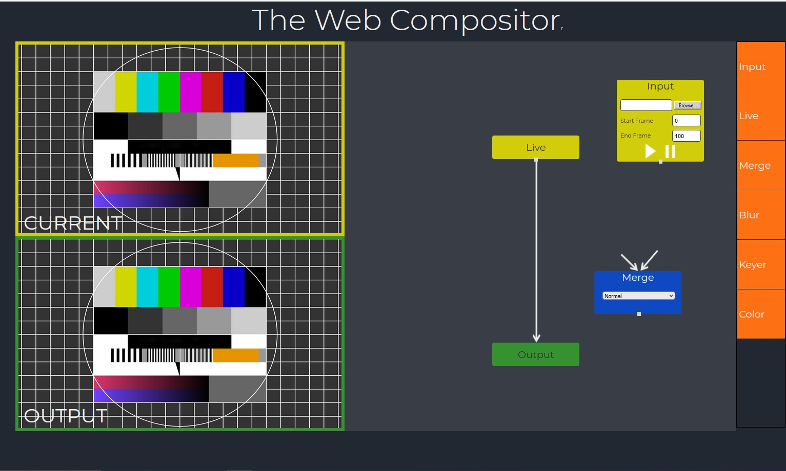
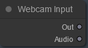
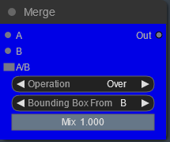

# Dokumentation

## Livecompositor


Philipp Nitsche (573651), Georgios Padopoulos (572727), Timo Schnorz
(577603), Aleksej Hinze (580341) \| Multimedia: Audio und Video \|
27.01.2022

## Inhaltsverzeichnis

1.  Installationsanleitung

2.  Benutzeranleitung und Tastenbelegung

3.  Aufnahme

4.  Technische Projektbeschreibung

    a.  Konzept

    b.  Ergebnis

    c.  Technische Umsetzung

5.  Verwendete Technologie

## Installationsanleitung

Voraussetzung zur Installation:

-   Git Bash

-   React JS Library

    Zum Starten des Livecompositors muss das git Repository geclont werden und anschließend ein Wechsel in den Ordner des
    Livecompositors erfolgen:

    ```bash
    git clone https://github.com/programmdeveloper/MMAV_Abschlussbeleg.git
    cd livecompositor
    ```

    Um die benutzen Pakete zu installieren, muss dann der Befehl

    ```
    npm install
    ```

    ausgeführt werden.

    Nach einer kurzen Wartezeit kann das Programm schließlich mit dem
    Befehl

    ```
    npm start
    ```

    gestartet werden.

## Benutzeranleitung und Tastenbelegung

Mit einem Rechtsklick auf den Bereich des noch leeren Nodegraphs können
neue Nodes hinzugefügt werden. Alle verfügbaren Nodes sind in dem
Kontextmenü zu finden, welches erscheint. Die Nodes sind dabei in
Gruppen unterteilt, um eine bessere Übersichtlichkeit zu gewährleisten.

Der Nodegraph lässt sich mit dem Mausrad vergrößern oder verkleinern, um
einen größeren oder kleineren Ausschnitt des Grafen zu sehen. Mit
gedrückter linker Maustaste kann die Ansicht zudem verschoben werden.

Nach der Erstellung kann eine Node mit einem Rechtsklick zudem in ihrer
Farbe, Größe oder Form verändert oder gar komplett wieder entfernt
werden. Zum verbinden der Nodes muss eine Verbindung von dem Ausgang der
einen zu dem Eingang einer anderen Node gezogen werden. Es können nur
Ein- bzw. Ausgänge miteinander verbunden werden, die miteinander
kompatibel sind. (Ein Videoausgang kann nicht mit einem Audioeingang
verbunden werden.). Auf diese Weise können beliebige Effekte durch den
Livecompositor erzielt werden. Die Nodes können zudem zu einer Gruppe
zusammengeschlossen werden, um eine noch bessere Übersichtlichkeit für
den Nutzer zu ermöglichen.


Abb.2 Output Nodes

Um ein Ergebnis zu sehen, müssen sowohl Audio-, als auch
Videoeffektketten am Ende immer mit einer Output-Node verbunden sein,
die auf „Active" geschaltet ist. Es kann zu jederzeit maximal eine
aktive Output-Node von jeder Sorte geben. Das visuelle Ergebnis wird im
„Output View" ausgegeben. Hier ist zu erkennen, wie das Ergebnis
aussehen wird, wenn es aufgenommen wurde. Ein roter Rahmen kennzeichnet
dabei den Bereich, der aufgenommen wird. Auch im „Output View" kann wie
im Nodegraph mit der Maus navigiert und die Ansicht verändert werden.

Unter dem „Output View" befindet sich ein Mischpult und die Sektion für
Aufnahmen. Über das Mischpult besteht die Möglichkeit, externe
Audiodatein von der Festplatte zu laden, abzuspielen und mit dem Audio
aus dem Nodegraph zusammen zu mischen. Zudem steht ein „Master-Volume"
zur Verfügung, um die Gesamtlautstärke des Projektes zu manipulieren.

## Aufnahme

Um ein Ergebnis aufzuzeichnen, muss lediglich die korrekte Framerate
gewählt und anschließend auf „Record" gedrückt werden, um die Aufnahme
zu starten. Mit „Stop" wird die Aufnahme angehalten. Anschließend kann
das aufgenommene Video mit einem Klick auf „Download Record"
heruntergeladen werden.

## Technische Projektbeschreibung

Im Folgenden stellen wir die technischen Details unseres Projekts vor

### Konzept:

Als erstes Konzept hatten wir einen Inputstream, der durch einige Nodes
läuft und somit mit Effekten versehen werden kann oder mit anderen
Streams kombiniert werden kann. Nach dem Anwenden aller Effekte kann man
dann das Ergebnis im Outputstream betrachten.



Abb.3 Erster Prototyp in Form eines Mockups

### Ergebnis:

Im Laufe der Entwicklung haben wir uns dafür entschieden, den
Inputstream nicht extra anzuzeigen, da man das durch die gegebene
Modularität auch mit einer entsprechenden Nodekombination sehr einfach
erreichen konnte.


Abb.4 Livecompositor GUI

Auf der linken Seite befindet sich der Nodeeditor, rechts oben der
„Output View" und rechts unten das Audiomischpult und die
Aufnahmeoptionen.

### Technische Umsetzung - Nodes:

Im folgendem beschreiben wir die von uns programmierten Nodes und ihre
Effekte:

#### Brightness-Effect-Node


Die BrighnessEffectNode ist ein Node mit dem die Videohelligkeit
eingestellt werden kann. Man kann dabei über einen Slider einen
Helligkeitswert zwischen -100 und 100 wählen.

#### Contrast-Effect-Node


Der Kontrast des Videos kann über diese Node angepasst werden. Über
Slider kann hier ein Wert zwischen -100 und 100 für den Kontrast gewählt
werden

#### Negative-Effect-Node


Die Node invertiert die Farben des Inputs.

#### Interpolation-Effect-Node

Diese Node interpoliert zwischen 3 verschieden Farbwerten (weiß, grau,
schwarz), das heißt abhängig von der Ausgangsfarbe des Pixels wird diese
als Schwarz(0,0,0), grau(127.5,127.5,127.5) oder weiß(255,255,255)
dargestellt

#### Grayscale-Effect-Node


Eine Node welche das Bild entsättigt und einen schwarzweiß Effekt
bewirkt.

#### Duotone-Effect-Node


Diese Node baut einen Gradienten zwischen zwei Farben auf. Dieser
entspricht mit seinen default Werten einem grayscale effect (Gradient
zwischen weiß und schwarz). In seinen Properties können zwei Farben in
hexadezimaler Schreibweise angegeben werden und somit einen Gradienten
zwischen den beiden neuen Farben aufbauen (z.B. ein Gradient zwischen
Lila und Orange)

Bei Angabe invalider Zeichenketten (z.B #GGTT66 oder einer
Hexadezimalfarbe ohne \# wie z.B 0066FF) bleibt die Farbe unverändert

#### Chromakeying-Effect-Node


Ein chroma key Effekt für schwarz, weiß, grün, rot und blau. Die Farbe,
die gekeyed werden soll kann dabei in der Node ausgewählt werden(combo
box preset). Die voreingestellte Farbe ist Grün.

#### Image-Input-Node


Diese Node ermöglicht es, Videos von der Festplatte zu laden und im
Nodeeditor zu benutzen. Als Inputnode hat sie nur einen Ausgang. Über
„Upload" kann die entsprechende Videodatei ausgewählt werden, deren URL
in dem Textfeld darunter erscheint. „Play/Pause" spielt das Video ab
oder hält es an. Wenn „Loop" angeschaltet ist, wird das Video gelooped,
ansonsten läuft es nur einmal durch. Mit „Speed" kann die
Abspielgeschwindigkeit des Videos langsamer oder schneller gemacht
werden. Zusätzlich besitzt die Image-Input-Node einen
Trigger-Event-Eingang, mit dem Play und Pause getriggert werden können.
So können mehrere Videos gleichzeitig gestartet werden.

#### Webcam-Input-Node



Über diese Node kann auf die Webcam zugegriffen werden.

#### 

#### Random-Noise-Node


Auch diese Node zählt zu den Inputnodes. Sie erzeugt ein zufälliges
Rauschen, dessen Format eingestellt werden kann.

#### Merge-Node



Die Merge-Node zählt zu den wichtigsten Nodes. Sie ermöglicht das
zusammenführen und überlagern mehrerer separater Videoketten. Dabei
liegt Input A immer über Input B. Es stehen verschiedene
Mergeoperationen zur Auswahl:

-   Over: Nur an semitransparenten Stellen (A\< 1) scheint Input B durch
    (A+B(1-a))

-   Multiply: A und B werden miteinander multipliziert (A\*B)

-   Add: A und B werden addiert (A+B)

-   Subtract: B wird von A subtrahiert (A-B)

Die Stärke der Überlagerung kann mit dem Mixslider beeinflusst werden.
Wenn Inputs in unterschiedlichen Formaten zusammen gemerged werden, wird
Input A standardmäßig auf die Größe von Input B gecropt. Dies kann mit
der Einstellung „Bounding Box From" getauscht werden. Auch diese Node
kann ein Trigger-Event empfangen. „A/B" setzt den Mixslider dabei
abwechselnd auf 1.0 und 0.0. Auf diese Weise kann ein Schnitt realisiert
werden.

#### Audio-Merge-Node


Diese Node erfüllt dieselbe Aufgabe, wie die Merge-Node, nur dass mit
ihrer Hilfe zwei Audiostreams zusammengemixt werden können. Über die
Slider „Volume A" und „Volume B" können die Lautstärken der Streams
individuell angepasst werden.

#### Button-Trigger-Node


Die Button-Trigger-Node erzeugt ein Trigger-Event, das in anderen Nodes
für Aktionen genutzt werden kann.

## Verwendete Technologien

-   React.js

-   Litegraph.js

Das Frontend wurde vollständig mit React.js gebaut
(<https://reactjs.org/>).

Für den Nodegrafen wurde die großartige Bibliothek Litegraph.js
verwendet (<https://github.com/jagenjo/litegraph.js/>). Diese Bibliothek
stellte die Voraussetzung und die Logik zum rendern eines Nodegrafen und
dem Transportieren von Datenströmen über Nodes hinweg. Durch die
einfache Möglichkeit, selber Nodes zu implementieren, war sie perfekt
für dieses Projekt geeignet. Alle zur Verfügung stehenden Nodes wurden
dabei eigenständig im Laufe des Projektes implementiert.
